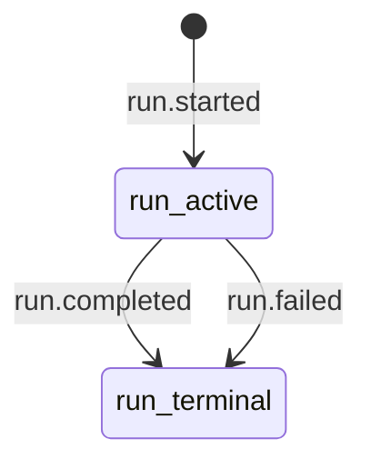

<!-- GENERATED by fast-agent-harness docsgen; do not edit. Source: internal/protocol, internal/eventlog -->

# Protocol Events Reference

This reference documents the event envelope, event-type vocabulary, and lifecycle rules that have a runtime-owned declarative table.

## Envelope Fields

| Field         | JSON           | Description                                       |
| ------------- | -------------- | ------------------------------------------------- |
| SchemaVersion | schema_version | Event schema version; zero is accepted as legacy  |
| Seq           | seq            | Monotonic sequence within an event stream         |
| Source        | source         | Emitter class from EventSourceDocs                |
| TS            | ts             | RFC3339Nano event timestamp                       |
| SubmissionID  | submission_id  | Submission/request correlation id                 |
| RunID         | run_id         | Run lifecycle correlation id                      |
| TurnID        | turn_id        | Conversation turn correlation id                  |
| StepID        | step_id        | Runtime step correlation id                       |
| CallID        | call_id        | Tool/user-input call correlation id               |
| AttemptID     | attempt_id     | Tool attempt correlation id                       |
| ParentStepID  | parent_step_id | Parent step for nested tool-call steps            |
| ProfileHash   | profile_hash   | Profile/instruction hash captured for diagnostics |
| DurationMS    | duration_ms    | Duration in milliseconds when known               |
| Type          | type           | Event type from EventTypeDocs                     |
| Data          | data           | Event-specific payload                            |

## Event Types

| Type                      | Required IDs                                  | Payload                  | Description                                               |
| ------------------------- | --------------------------------------------- | ------------------------ | --------------------------------------------------------- |
| run.started               | run_id                                        | map[string]any           | Run lifecycle begins                                      |
| turn.started              | run_id, turn_id                               | TurnEvent                | Conversation turn begins                                  |
| turn.completed            | run_id, turn_id                               | TurnEvent                | Conversation turn reaches a terminal status               |
| turn.change_recorded      | run_id, turn_id                               | TurnChangeEvent          | Filesystem changes were recorded for a turn               |
| turn.change_reverted      | run_id, turn_id                               | TurnChangeEvent          | Recorded turn changes were reverted or restored           |
| step.started              | run_id, turn_id, step_id                      | StepEvent                | Runtime step begins                                       |
| step.completed            | run_id, turn_id, step_id                      | StepEvent                | Runtime step completes                                    |
| model.call_started        | run_id, turn_id, step_id                      | ModelCallEvent           | Provider model call begins                                |
| model.call_finished       | run_id, turn_id, step_id                      | ModelCallEvent           | Provider model call finishes                              |
| assistant.reasoning_delta | run_id, turn_id, step_id                      | string                   | Assistant reasoning stream delta                          |
| assistant.content_delta   | run_id, turn_id, step_id                      | string                   | Assistant content stream delta                            |
| tool.call_requested       | run_id, call_id                               | ToolCall                 | Model requested a tool call                               |
| tool.permission_requested | run_id, call_id                               | ToolPermissionEvent      | Tool policy requested an approval decision                |
| tool.permission_decided   | run_id, call_id                               | ToolPermissionEvent      | Tool approval decision was recorded                       |
| tool.audit                | run_id, call_id                               | map[string]any           | Tool policy/audit metadata was emitted                    |
| tool.call_progress        | run_id, call_id                               | ToolProgressEvent        | Tool call emitted progress metadata                       |
| tool.call_started         | run_id, call_id, attempt_id                   | string                   | Tool call attempt begins                                  |
| tool.call_finished        | run_id, call_id, attempt_id                   | ToolResult               | Tool call attempt completed successfully                  |
| tool.call_failed          | run_id, call_id, attempt_id                   | ToolResult               | Tool call attempt failed                                  |
| tool.call_aborted         | run_id, call_id, attempt_id                   | ToolResult               | Tool call attempt was aborted                             |
| tool.output_ref_created   | run_id, call_id, attempt_id                   | ToolOutputRefEvent       | Large tool output was stored behind an output ref         |
| context.threshold         | run_id                                        | ContextThresholdEvent    | Context budget threshold was crossed                      |
| context.compacted         | run_id                                        | map[string]any           | Context compaction completed                              |
| hook.started              | run_id                                        | HookEvent                | Hook execution begins                                     |
| hook.finished             | run_id                                        | HookEvent                | Hook execution finished                                   |
| hook.failed               | run_id                                        | HookEvent                | Hook execution failed                                     |
| run.completed             | run_id                                        | -                        | Run completed successfully                                |
| run.failed                | run_id                                        | string                   | Run failed                                                |
| provider.usage            | run_id, turn_id, step_id                      | map[string]any           | Provider token usage snapshot was updated                 |
| provider.helper_usage     | run_id                                        | ProviderHelperUsageEvent | Helper model/API usage was recorded                       |
| session.status            | -                                             | gatewayapi.SessionStatus | Gateway emitted a session status snapshot                 |
| gateway.stream_gap        | -                                             | GatewayStreamGapEvent    | Gateway live stream dropped events and replay is required |
| stream.still_running      | -                                             | StreamStillRunningEvent  | Long-running stream heartbeat                             |
| session.imported          | -                                             | SessionImportedEvent     | External transcript import completed                      |
| user_input.requested      | run_id, turn_id, step_id, call_id, attempt_id | UserInputRequestEvent    | Tool requested user input                                 |
| user_input.answered       | run_id, turn_id, step_id, call_id, attempt_id | UserInputAnswerEvent     | User input request was answered                           |
| user_input.rejected       | run_id, turn_id, step_id, call_id, attempt_id | UserInputRejectEvent     | User input request was rejected                           |

## Lifecycle Rules

This section is intentionally partial: it renders only lifecycle entities whose structural checks are consumed from `internal/eventlog.LifecycleRules()`. Turn, step, tool-attempt, output-ref, user-input, and hook checks remain procedural in `LifecycleValidator.Observe()` because they depend on optional ids, payload phases, or cross-map ownership.

| Event         | Entity | Kind       | Parent | Terminal |
| ------------- | ------ | ---------- | ------ | -------- |
| run.started   | run    | starts     | -      | false    |
| run.completed | run    | terminates | -      | true     |
| run.failed    | run    | terminates | -      | true     |

### run

## Event Sources

| Source   | Description                                  |
| -------- | -------------------------------------------- |
| agent    | Agent runtime loop and tool orchestration    |
| gateway  | Gateway session, replay, and transport layer |
| tui      | Terminal UI client                           |
| telegram | Telegram adapter client                      |
| tool     | Native or MCP tool execution                 |
| provider | Model provider client                        |
| mcp      | MCP server or client integration             |
| bench    | Benchmark and replay tooling                 |

<!-- source-hash: e5ef174e210ac67a66969f115ab0eedb76ff439929012ebd995db93bf3f2ac0f -->
